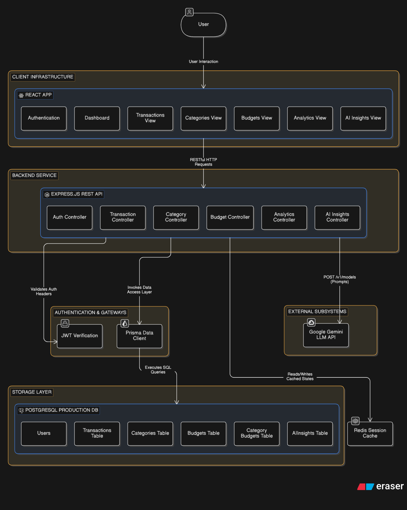
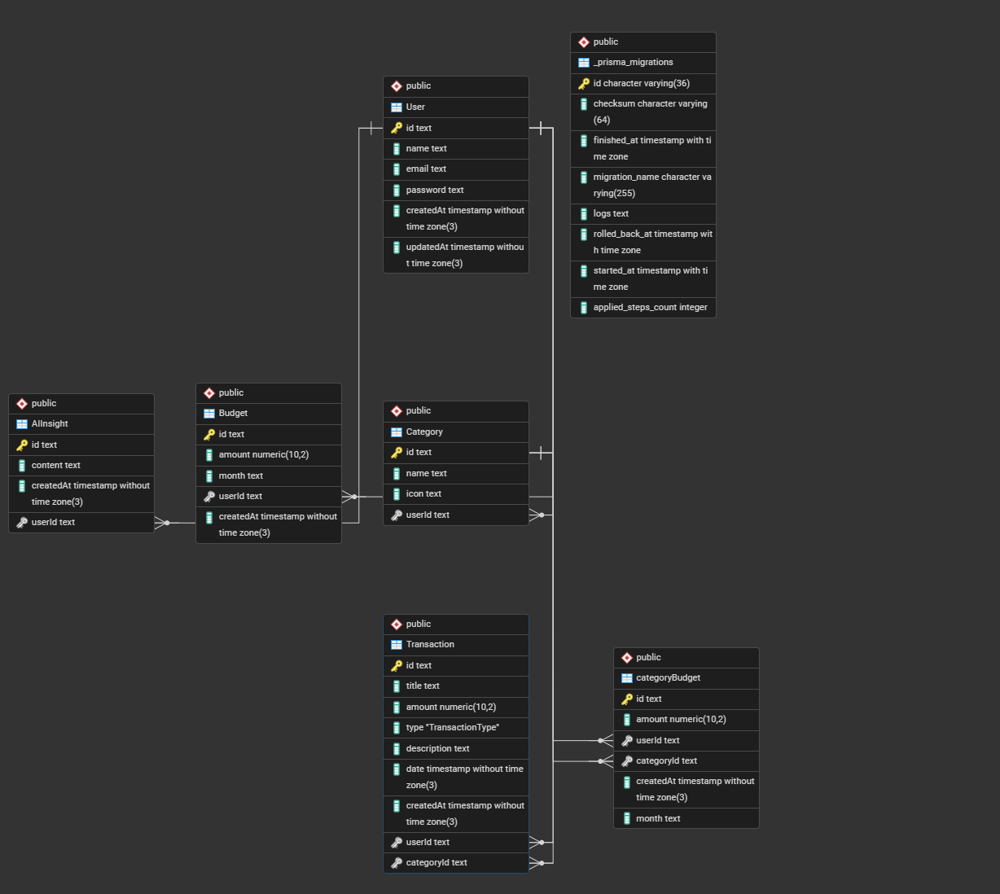

<h1 align="center">
  
  AI Powered Personal Finance Analytics Platform
</h1>

A full-stack web application designed to help users manage their finances through intelligent budgeting, transaction tracking, spending analysis, and financial insights.

The platform enables users to record income and expenses, organize transactions into categories, create monthly and category-based budgets, and monitor financial performance through a centralized analytics dashboard.

Instead of functioning as a simple expense tracker, the application transforms financial data into meaningful insights. Users can visualize spending patterns, compare income and expenses, track budget utilization, identify high-spending categories, and understand their overall financial health.

## Workflow

The application follows a structured financial management process:

### 1. User Authentication
Users create an account and securely log in to access their personal financial workspace.

### 2. Category Management
Users create custom categories such as Food, Travel, Shopping, Bills, Entertainment, Salary, Investments, and others to organize financial activities.

### 3. Budget Planning
Users define:
- **Monthly Budgets** - Overall spending limits for each month
- **Category-Based Budgets** - Specific limits per spending category

These budgets act as spending limits and financial goals.

### 4. Transaction Tracking
Users record:
- **Income Transactions** - Salary, freelance, investments, etc.
- **Expense Transactions** - Bills, shopping, food, etc.

Each transaction is linked to a category, amount, date, and description.

### 5. Financial Analysis
The system processes transaction data and calculates:
- **Total Income**
- **Total Expenses** 
- **Net Savings**
- **Budget Utilization**
- **Category Spending Distribution**
- **Monthly Spending Trends**

### 6. Dashboard Insights
The dashboard presents financial analytics through charts, summaries, and performance indicators, helping users make informed financial decisions.

### 7. AI-Powered Recommendations
The platform generates personalized financial insights by analyzing spending behavior, budget adherence, and savings patterns.

## Core Objective

The primary goal of this project is to provide users with a complete financial management ecosystem where budgeting, expense tracking, analytics, and intelligent insights work together to improve financial awareness and decision-making

## 🏗️ System Architecture

## 🗄️ Database Architecture & Schema

This application utilizes **PostgreSQL** as its primary relational database management system, with **Prisma ORM** handling data migrations and structural state mapping.

### 📐 Entity Relationship Diagram (ERD)

The diagram below outlines the core entities, data field typings, internal relations, and foreign key bindings tracked within the application schema.

  

---

### 📊 Data Dictionary & Table Index

#### 1. Core User & Meta Tables
*   **`User`**: Manages unique application accounts, metadata, and core auth signatures.
*   **`_prisma_migrations`**: Internal system tracking ledger managed automatically by the Prisma migration engine.

#### 2. Financial Ledger & Structuring
*   **`Transaction`**: High-throughput transaction ledger capturing granular financial inflows and outflows.
*   **`Category`**: Configurable, user-specific classification tags applied to isolate transactions.
*   **`Budget`**: Aggregated overarching balance limitations defined on a per-month scheduling sequence.
*   **`categoryBudget`**: Fine-grained mapping junction to assign dedicated sub-budgets to unique structural categories.
*   **`AIInsight`**: Historical intelligence analytics logs generated dynamically via the Google Gemini LLM API engine.

---

### 📝 Detailed Schema Mapping

| Table Name | Attribute / Column | Data Type | Modifiers / Constraints | Description |
| :--- | :--- | :--- | :--- | :--- |
| **User** | `id`   `name`   `email`   `password`   `createdAt`   `updatedAt` | text   text   text   text   timestamp(3)   timestamp(3) | **Primary Key**   -   Unique   -   Default: `now()`   Auto-update | Unique system identifier.   Full display name.   Registration email.   Hashed credential.   Creation metadata.   Modification track. |
| **Transaction** | `id`   `title`   `amount`   `type`   `description`   `date`   `createdAt`   `userId`   `categoryId` | text   text   numeric(10,2)   "TransactionType"   text   timestamp   timestamp(3)   text   text | **Primary Key**   -   -   Custom Enum   Optional   -   Default: `now()`   **Foreign Key**   **Foreign Key** | Unique system identifier.   Transaction description.   Value up to 2 decimals.   INCOME / EXPENSE type.   Contextual user notes.   Actual transaction date.   Records sync tracking.   Links to `User.id`.   Links to `Category.id`. |
| **Category** | `id`   `name`   `icon`   `userId` | text   text   text   text | **Primary Key**   -   Optional   **Foreign Key** | Unique system identifier.   Visual display label.   Graphical layout reference.   Links custom categories. |
| **Budget** | `id`   `amount`   `month`   `userId`   `createdAt` | text   numeric(10,2)   text   text   timestamp(3) | **Primary Key**   -   -   **Foreign Key**   Default: `now()` | Unique system identifier.   Spending limit constraint.   Tracking period (MM-YYYY).   Links to target `User.id`.   Records sync tracking. |
| **categoryBudget** | `id`   `amount`   `userId`   `categoryId`   `createdAt`   `month` | text   numeric(10,2)   text   text   timestamp(3)   text | **Primary Key**   -   **Foreign Key**   **Foreign Key**   Default: `now()`   - | Unique system identifier.   Target balance cap.   Links to `User.id`.   Links to `Category.id`.   Records sync tracking.   Tracking target string. |
| **AIInsight** | `id`   `content`   `createdAt`   `userId` | text   text   timestamp(3)   text | **Primary Key**   -   Default: `now()`   **Foreign Key** | Unique system identifier.   LLM generation payload.   Insight generation history.   Links to target `User.id`. |
